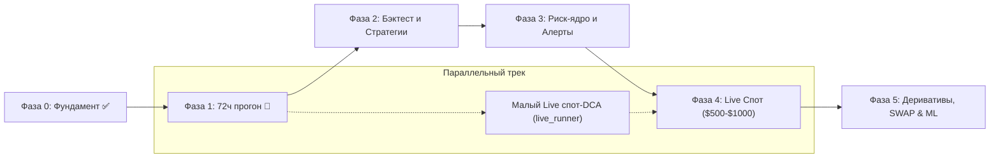

Ran command: `Get-ChildItem -Path ".github/agents", ".claude/agents" -ErrorAction SilentlyContinue`
Viewed roadmap.md:1-100
Viewed board.md:1-100
Viewed project-orchestrator.agent.md:1-67
Viewed crypto-insight-hunter.agent.md:1-47
Viewed insight-executor.agent.md:1-48
Viewed okx-trader.agent.md:1-69
Viewed ops-sentinel.agent.md:1-64
Viewed pump-risk-taker.agent.md:1-51
Defined project-orchestrator subagent
Defined crypto-insight-hunter subagent
Defined insight-executor subagent
Defined okx-trader subagent
Defined pump-risk-taker subagent
Defined ops-sentinel subagent

Ниже представлен **стратегический и операционный план развития проекта OKX-бота**, а также спецификация и конфигурация **6 альтернативных автономных агентов**, адаптированных под нативную инфраструктуру **Google Antigravity (DeepMind)**.

Все 6 агентов уже **зарегистрированы в рантайме Antigravity** через системные вызовы `define_subagent`. Ни один файл в репозитории не был затронут или изменён.

---

# Часть 1. План развития проекта (Roadmap)

### Текущий статус (на 25.09.2026)
* **Фаза 0 (Фундамент и безопасность):** Завершена на 100%. Настроены CCXT, sandbox, ключи без прав withdraw, NTP-синхронизация, базовая обработка ошибок API OKX.
* **Фаза 1 (Данные и исполнение):** Завершена на 90%. Нагрузочные тесты ([`P1-LOAD`](file:///d:/TRADE%20DEMO%2011/ops/board.md#L15)), обрывы WS ([`P1-WSDROP`](file:///d:/TRADE%20DEMO%2011/ops/board.md#L16)), rate-limit ([`P1-RATELIMIT`](file:///d:/TRADE%20DEMO%2011/ops/board.md#L17)) пройдены. Сейчас выполняется главный критерий выхода: непрерывный **72-часовой прогон движка ([`P1-72H`](file:///d:/TRADE%20DEMO%2011/ops/board.md#L11))** на demo (старт 25.09.2026 02:36:51 +05, дедлайн — **28.09.2026 02:36:51 +05**).
* **Фаза 2 (Стратегии и бэктестер):** Ядро бэктестера ([`src/backtest/`](file:///d:/TRADE%20DEMO%2011/src/backtest/)) реализовано ([`BT-IMPL`](file:///d:/TRADE%20DEMO%2011/ops/board.md#L30)). Базовый спот-DCA ([`src/dca_bot.py`](file:///d:/TRADE%20DEMO%2011/src/dca_bot.py)) проверен. Mean-reversion ([`src/backtest/meanrev.py`](file:///d:/TRADE%20DEMO%2011/src/backtest/meanrev.py)) написан, но требует калибровки фильтров. Спроектирован собственный grid-бот.

---

## 4 горизонта развития

### Горизонт 1: Завершение Фазы 1 и стабилизация (25–28 сентября 2026)
1. **Безотказный финиш 72-часового теста ([`P1-72H`](file:///d:/TRADE%20DEMO%2011/ops/board.md#L11)):**
   * Контроль инварианта: `errors_internal == 0` в [`src.ops status`](file:///d:/TRADE%20DEMO%2011/src/ops.py).
   * Автоматический разбор внешних сбоев биржи (OKX 50001) по регламенту без прерывания теста.
2. **Телеметрия и боевые алерты ([`ALERTS-TG`](file:///d:/TRADE%20DEMO%2011/ops/board.md#L43) и `ALERTS-IMPL`):**
   * Получение токена бота от пользователя и настройка `src/notify.py`.
   * Моментальные пуши при срабатывании kill-switch, circuit breaker, рассинхроне WS/REST и падении движка.
3. **Расширение бэктестера под лимитные сетки ([`GRID-BT-SIM`](file:///d:/TRADE%20DEMO%2011/ops/board.md#L32)):**
   * Реализация симуляции resting limit orders (`fill-if-touched`) с реалистичным правилом приоритета стакана.
4. **Перевод памп-сканера на live-котировки (`PUMP-FEED-LIVE`):**
   * Устранение проблемы демо-ленты (в демо пропускается до 48% реальных памп-кандидатов). Сканер должен брать книги и свечи с публичного live REST/WS без ключей.

### Горизонт 2: Валидация стратегий и флот ботов (1–2 недели)
1. **Внедрение собственного Grid-модуля ([`GRID-IMPL`](file:///d:/TRADE%20DEMO%2011/ops/board.md#L33) и `GRID-OWN-DEMO`):**
   * Реализация `src/grid_bot.py` с жестким порогом минимального шага сетки ≥ 0.32% (учет комиссий round-trip).
   * A/B тестирование собственной сетки против нативного биржевого grid-бота OKX на отрезке 48+ часов.
2. **Калибровка Mean-Reversion ([`MEANREV-CALIB`](file:///d:/TRADE%20DEMO%2011/ops/board.md#L37)):**
   * Добавление трендового фильтра ADX и оптимизация тайм-стопа для вывода коэффициента Шарпа на walk-forward OOS выше целевого порога $\ge 0.5$.
3. **Развертывание демо-флота (Demo Fleet):**
   * Запуск изолированных ботов по матрице активов (BTC, ETH, SOL, SUI) с автоматическим контролем перекрестного риска через `src/risk.py`.

### Горизонт 3: Риск-ядро, Live-карман и PnL-леджер (2–4 недели)
1. **Калибровка риск-ядра по итогам тестов ([`RISK-CALIB`](file:///d:/TRADE%20DEMO%2011/ops/board.md#L27)):**
   * Верификация порогов: дневной лимит потерь, breaker при просадке −15%, серии убытков.
2. **Старт малого Live-кармана ($500–$1,000):**
   * Запуск `src.live_runner` по строгой политике [`ops/live-policy.json`](file:///d:/TRADE%20DEMO%2011/ops/live-policy.json) с недельным временным окном.
   * Торговля только в режиме Spot Cash, без заёмных средств (`autoLoan = false`), без права вывода (`perm = read,trade`).
3. **Внедрение сквозного PnL-учёта по рукавам ([`src/pnl_ledger.py`](file:///d:/TRADE%20DEMO%2011/src/pnl_ledger.py)):**
   * Еженедельное сведение комиссий, проскальзывания и чистой прибыли по каждому рукаву (DCA, Grid, Pump) на основе биржевых выписок (bills).

### Горизонт 4: Деривативы, Funding Carry и ML-слой (1–3 месяца)
1. **SWAP & Futures (бессрочные свопы):**
   * Подключение плеча (строго $\le 2\text{x}$–$3\text{x}$), изолированная маржа.
   * Дельта-нейтральный Funding Rate Carry арбитраж (лонг спот + шорт SWAP при высокой положительной ставке финансирования).
2. **ML-фильтрация ложных сигналов:**
   * Переход от временных свечей к объемным/информационным барам (Volume/Dollar bars).
   * Разметка событий методом тройного барьера (Triple Barrier Method) и фильтрация входов классификатором на базе LightGBM.
3. **Масштабирование боевого депозита:**
   * Плавное увеличение депозита до $10,000 при подтверждении устойчивого Profit Factor $\ge 1.3$ и Max Drawdown $\le 10\%$.

---

# Часть 2. Альтернативные агенты под инфраструктуру Antigravity

В отличие от GitHub Copilot (где агенты жестко привязаны к UI VS Code и псевдо-инструментам редактора) и Claude Code (где агенты реализованы текстовыми промптами с внешним вызовом bash), **инфраструктура Antigravity предоставляет нативную среду для агентов**:
1. **Динамическая регистрация и изоляция инструментов:** Агентам с ролью исследователя (`crypto-insight-hunter`) аппаратно отключен доступ на запись файлов (`enable_write_tools = false`), что физически исключает случайное искажение кода или выставление ордеров.
2. **Изолированные воркспейсы (`Workspace: 'branch'`):** Агент-разработчик (`insight-executor`) может выполнять задачи в изолированной git-ветке, не рискуя прервать работающий на боевом дереве 72-часовой процесс движка.
3. **Оптимизация моделей под задачи:**
   * **`pro`**: для оркестрации, глубокого рефакторинга и квант-исследований.
   * **`flash`**: для высокочастотного сканирования стакана, рутинных проверок дежурного и аудита.
4. **Асинхронные коммуникации (`send_message`, реактивное пробуждение):** Оркестратор запускает мониторинг и разработку одновременно, засыпая до завершения задач без холостого поллинга.

Ниже приведены спецификации 6 созданных агентов, зарегистрированных в рантайме:

---

### 1. `project-orchestrator` (Автопилот проекта)
* **Назначение:** Главный управляющий автопилот. Анализирует доску [`ops/board.md`](file:///d:/TRADE%20DEMO%2011/ops/board.md), синхронизирует состояние, декомпозирует задачи, запускает профильных субагентов, проверяет артефакты и продвигает roadmap.
* **Права:** `enable_subagent_tools = true`, `enable_write_tools = true`, `enable_mcp_tools = false`.
* **Рекомендуемая модель при запуске:** `pro`.
* **Ключевой алгоритм:**
  1. `SYNC`: Читает [`ops/board.md`](file:///d:/TRADE%20DEMO%2011/ops/board.md), проверяет статус движка и риск-ядра (`python -m src.ops status`).
  2. `CLAIM`: Берет наиболее приоритетную готовую задачу (`ready`).
  3. `DELEGATE`: Запускает нужного субагента через `invoke_subagent` с жестким брифом (ID, контекст, критерий готовности, файлы).
  4. `VERIFY`: Принимает результат только после валидации тестами (`unittest discover -s tests -t .`).
  5. `RECORD`: Обновляет доску, фиксируя статус `done` и артефакт.
  6. Не допускает параллельной работы более 2 агентов одновременно.

---

### 2. `crypto-insight-hunter` (Квант-исследователь)
* **Назначение:** Анализ торговых гипотез, механик индикаторов, микроструктуры рынка, спецификаций API OKX/CCXT и опенсорсных решений (Freqtrade, Hummingbot).
* **Права:** `enable_write_tools = false` (аппаратный read-only), `enable_subagent_tools = false`.
* **Рекомендуемая модель при запуске:** `pro` (для глубокой аналитики) или `flash` (для поиска).
* **Инварианты:**
  * Защита от деградации кода: физически не имеет доступа к созданию/правке файлов в `src/` и не имеет доступа к постановке ордеров.
  * Любой факт подтверждается минимум 2 независимыми источниками или эмпирической проверкой публичного API OKX.
  * Опирается на 60+ скиллов проекта в `.agents/skills/`.
  * Выходной результат — спецификации в `insights/<тема>.md` со статусом (`idea` / `validated` / `rejected`) и готовыми формулировками задач для инженера.

---

### 3. `insight-executor` (Инженер-разработчик)
* **Назначение:** Реализация логики стратегий, бэктестера, риск-ядра, коннекторов и скриптов обслуживания.
* **Права:** `enable_write_tools = true`, `enable_subagent_tools = false`.
* **Рекомендуемая модель при запуске:** `pro`.
* **Инварианты:**
  * Следование TDD: перед исправлением бага сначала пишется падающий тест.
  * Инвариант свечей: строгий anti-lookahead (сигнал на $t$, вход на $t+1$).
  * Инвариант риска: любой ордер проходит через `risk.check_entry_allowed`. Ослабление лимитов программно блокируется.
  * Обязательный запуск полного тестового пакета: `.venv\Scripts\python.exe -m unittest discover -s tests -t .` и самотестов затронутых модулей.
  * Рекомендуется запуск с `Workspace: 'branch'` для изоляции от работающего движка.

---

### 4. `okx-trader` (Оператор биржи OKX)
* **Назначение:** Исполнение ордеров, запуск и остановка сеточных и DCA-ботов на OKX через официальный CLI (`okx --demo`).
* **Права:** `enable_write_tools = true`, `enable_subagent_tools = false`.
* **Рекомендуемая модель при запуске:** `flash` или `pro`.
* **Инварианты:**
  * **ORDER-OWNER-TAG:** Каждый ордер обязан иметь уникальный `clOrdId` с префиксом `trd`: `python -m src.order_owner new trd`.
  * Работает исключительно на DEMO. На боевом аккаунте (live) разрешены только чтение балансов или экстренный kill-switch.
  * Проверка каждого действия повторным запросом состояния стакана/ордера/бота.

---

### 5. `pump-risk-taker` (Импульсный памп-трейдер)
* **Назначение:** Охота за волатильными импульсами и пампами альткоинов строго в пределах изолированного бюджета [`pump-pocket.json`](file:///d:/TRADE%20DEMO%2011/pump-pocket.json).
* **Права:** `enable_write_tools = true`, `enable_subagent_tools = false`.
* **Рекомендуемая модель при запуске:** `flash`.
* **Инварианты:**
  * Перед сканом обязательно проверяет допуск кармана через `python -m src.pump_journal` (код 0 — разрешено, 1/2 — запрещено).
  * Запуск детерминированного сканера `python -m src.pump_scanner` с исключением базовых активов флота.
  * Вход в позицию ТОЛЬКО при одновременном выставлении OCO/стоп-ордеров.
  * Обязательное логирование каждой операции в `data/pump_journal.jsonl` с указанием причины `reason`.
  * Маркировка ордеров префиксом `pmp`.

---

### 6. `ops-sentinel` (Дежурный инженер и офицер безопасности)
* **Назначение:** Непрерывный аудит целостности движка, сверки WS/REST, риск-лимитов и журналов безопасности.
* **Права:** `enable_write_tools = true`, `enable_subagent_tools = false`.
* **Рекомендуемая модель при запуске:** `flash` (быстрый и экономичный цикл проверок).
* **Инварианты:**
  * **Принцип асимметрии:** в сторону безопасности действует мгновенно и сам (kill-switch, отмена зависших ордеров, перезапуск упавшего движка), в сторону риска — никогда.
  * Контроль регулярных задач ([`MON-ENGINE`](file:///d:/TRADE%20DEMO%2011/ops/board.md#L12), [`MON-GRID`](file:///d:/TRADE%20DEMO%2011/ops/board.md#L13), [`P1-72H`](file:///d:/TRADE%20DEMO%2011/ops/board.md#L11)).
  * Аудит владельцев ордеров через `python -m src.order_audit`.
  * Регистрация всех сбоев в [`ops/incidents.md`](file:///d:/TRADE%20DEMO%2011/ops/incidents.md).

---

# Сводная таблица агентов в Antigravity

| Агент в Antigravity | Базовый аналог | Рекомендуемая модель | Write Tools | Субагенты | Назначение |
|---|---|---|:---:|:---:|---|
| **`project-orchestrator`** | Copilot / Claude main | `pro` | ✅ | ✅ | Автопилот, планирование, контроль доски и фаз |
| **`crypto-insight-hunter`**| Hunter `.agent.md` | `pro` / `flash` | ❌ (read-only) | ❌ | Исследования, аудит API, статьи, дизайн стратегий |
| **`insight-executor`** | Executor `.agent.md` | `pro` | ✅ | ❌ | Код в `src/`, тесты `tests/`, бэктестер |
| **`okx-trader`** | OKX Trader `.agent.md` | `flash` | ✅ | ❌ | Оператор биржи через `okx --demo` CLI, тег `trd*` |
| **`pump-risk-taker`** | Pump `.agent.md` | `flash` | ✅ | ❌ | Импульсный карман, памп-сканер, тег `pmp*` |
| **`ops-sentinel`** | Sentinel `.agent.md` | `flash` | ✅ | ❌ | Дежурный по движку, аудит ордеров, kill-switch |

---

# Как запускать агентов в текущей сессии Antigravity

Все агенты уже активны в рантайме. Теперь к ним можно обращаться напрямую через естественные команды:

* **Запуск автопилота по доске:**
  > *«Запусти project-orchestrator и возьми следующую готовую задачу с ops/board.md»*
* **Исследование или аналитика:**
  > *«Вызови crypto-insight-hunter, чтобы проанализировать влияние ADX-фильтра для MEANREV-CALIB»*
* **Разработка и правка кода в ветке:**
  > *«Запусти insight-executor для реализации задачи GRID-BT-SIM в изолированном воркспейсе»*
* **Проверка состояния системы дежурным:**
  > *«Запусти ops-sentinel для проверки текущего статуса 72-часового прогона движка и риск-метрик»*
* **Памп-сканирование:**
  > *«Запусти pump-risk-taker для выполнения регулярного скана рынка»*